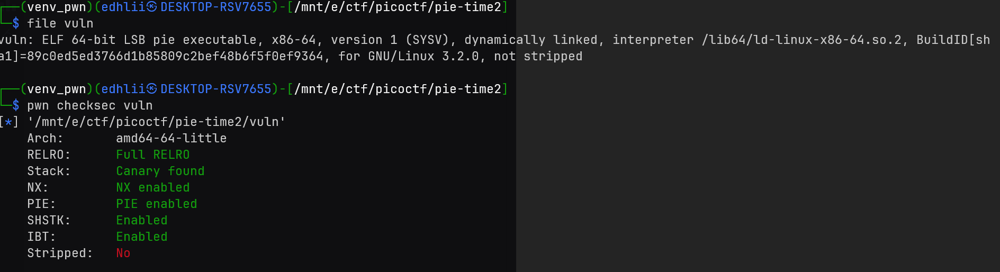
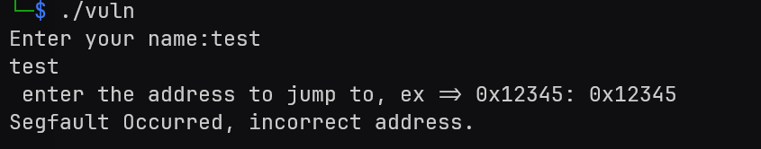
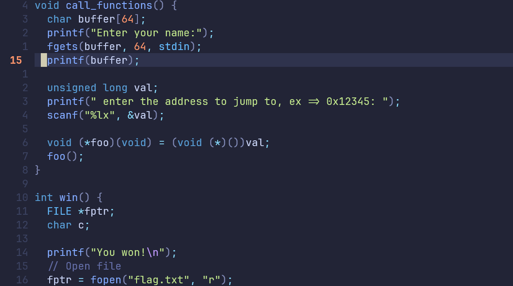
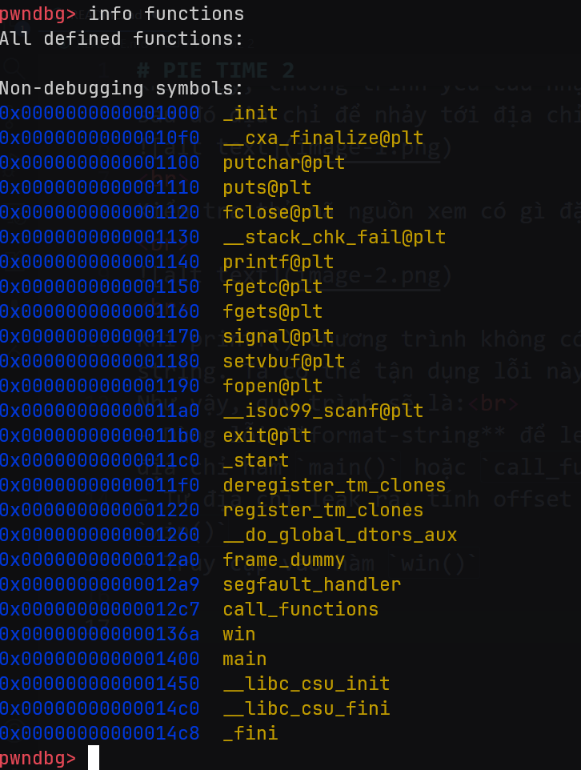
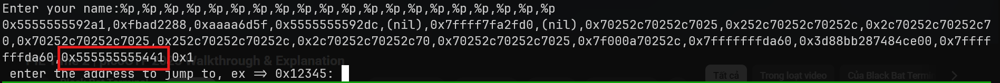
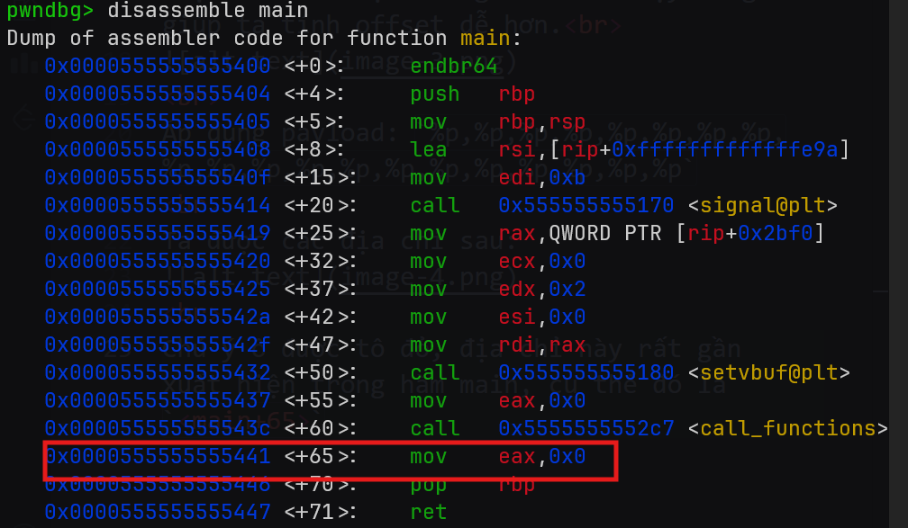
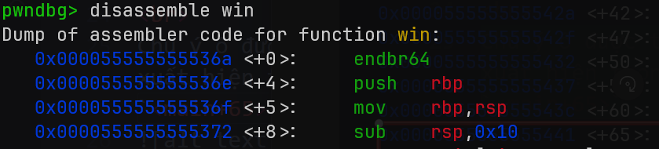
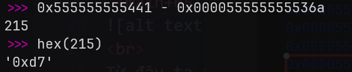
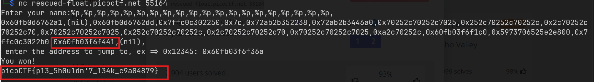

# PIE TIME 2
Challenge cung cấp file binary và mã nguồn. Đầu tiên tôi kiểm tra file cơ bản file binary:  

 
Khi chạy, chương trình yêu cầu nhập tên, sau đó địa chỉ để nhảy tới địa chỉ đó 

 
Kiểm tra thử mã nguồn xem có gì đặc biệt.  

 
Khi printf() chương trình không có format string. Ta có thể tận dụng lỗi này. 
Như vậy, quy trình sẽ là: 
- Dùng lỗi **format-string** để leak các địa chỉ hàm `main()` hoặc `call_functions()`
- Từ địa chỉ leak ra, tính offset tới hàm `win()`
- Truy cập vào hàm `win()`
 
Tôi dùng **gdb** để debug chương trình. Cần lưu ý là khi debug bằng gdb, PIE và ASLR sẽ được tắt để tiện debug hơn. Như vậy cũng giúp ta tính offset dễ hơn. 

 
Áp dụng payload: `%p,%p,%p,%p,%p,%p,%p,%p,%p,%p,%p,%p,%p,%p,%p,%p,%p,%p,%p,%p`
 
Ta được các địa chỉ sau:

 
Chú ý ô được tô đỏ, địa chỉ này rất gần xuất hiện trong hàm main, cụ thể đó là `<main+65>` 

 
Từ đây ta tính offset từ <main+65> tới win.
 

 

 

Như vậy, để truy cập vào win, ta chỉ cần leak ra địa chỉ <main+65> sau đó trừ đi offset. Giờ tôi kết nối tới server.
 
